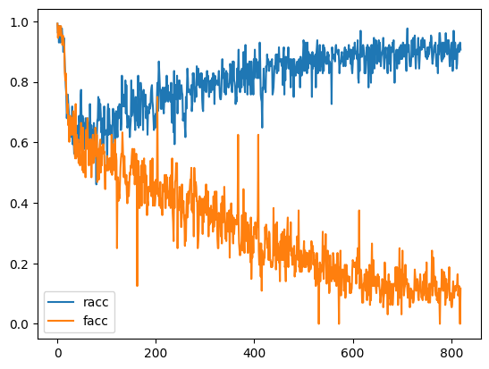

# Machine Unlearning

This code is based on my submissions on NeurIPS 2023 Machine Unlearning Challenge, which ranked terribly low in the sense of their metric (comparing to oracle model). However, it seems that it achieved huge accuracy decoupling between retain and forget dataset in training, seams that it has a chance to achieve the `unlearning`.

I will upload the code when all the code (including mock of nips unlearning, verifications) is ready, so far, I will just post the brief algorithms and ideation as below (SRFL : done).

# Unlearning Ideation

The code contains two novel way of unlearning, both of them achieved decoupling in forget/retain accuracy : forget goes low, while retain goes high.

1. SRFL (Simple Rolling in Forget Logits, that I submitted in the challenge.) 
2. ALIF (Auxilary Layer for Inducing Forget)

## SRFL   
Simple Rolling in Forget Logits (SRFL) is a simple way of disturbing the forget label in finetuning framework. 

Train curve in `CIFAR-10` (since cifar-10 from starter-kit, it would not represent facial unlearning as in the neurips challenge.)



### Algorithm
1. **Copy** a model from original trained model   

```
teacher_model <- copy.deepcopy(model)
teacher_model.eval() // teacher model will not be trained
```

2. **Freeze layers of model except for first two backbones (feature extracting)**

3. Loop : Generate logits by teacher model   
```
for data in datasets (retain + forget dataset):
    retain_data, forget_data <- data
    pseudo_forget_logits <- teacher_model(forget_data)
    pseudo_retain_logits <- teacher_model(retain_data)
```

4. **Roll** only the pseudo_forget_logits (same mechanism in torch.roll with random roll steps in [-1,1] )

```
    rolled_pseudo_logits <- roll(pseudo_forget_logits)
```

5. **Minimize** KL-divergence between rolled_pseudo_logits and model's output (from forget data), and use cosine similarity be a regularization and use retain_loss (KL-divergence between pseudo-label(not-rolled) and model outputs about retain dataset)    
```
    forget_outputs <- model(forget_data)
    retain_outputs <- model(retain_data)

    forget_loss <- \
        KLDiv(rolled_pseudo_logits, forget_outputs) + \
        -1 * cosine_similarity(rolled_pseudo_logits, 
        forget_outputs) + \
        KLDiv(pseudo_retain_logits, retain_outputs)
```

6. **backward** propagation by forget_loss
```
   forget_loss.backward()
```


## ALIF (Auxilary Layer for Inducing Forget)

TBD